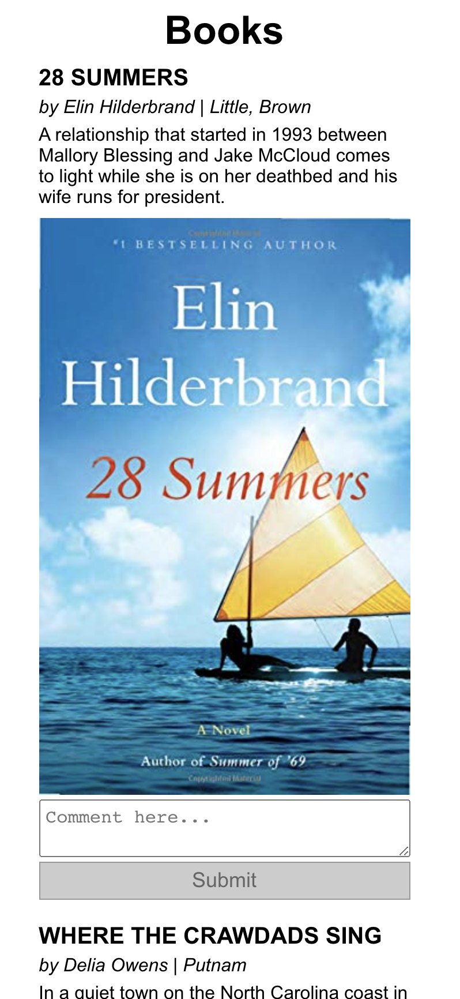

# Books with reviews
This application is built with React (using React Hooks). It fetches a list of books in the format of a text file and displays them on a page. Users can leave their comments for each book.

Here is a screenshot:

  

## Viewing the app
In the project directory run:
### `npm start`
and open [http://localhost:3000](http://localhost:3000) to view it in the browser.
